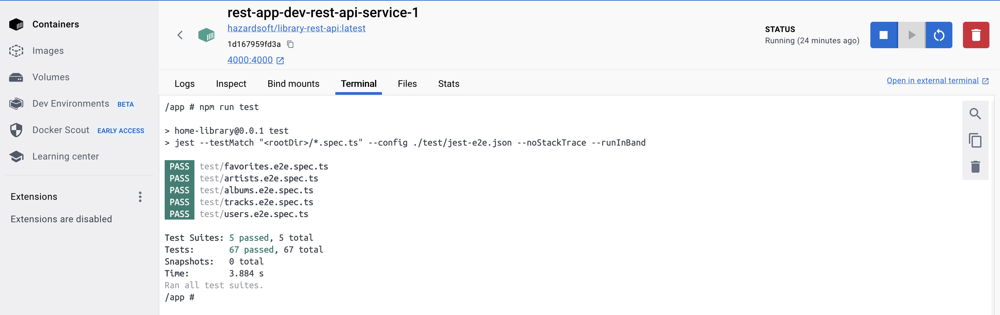
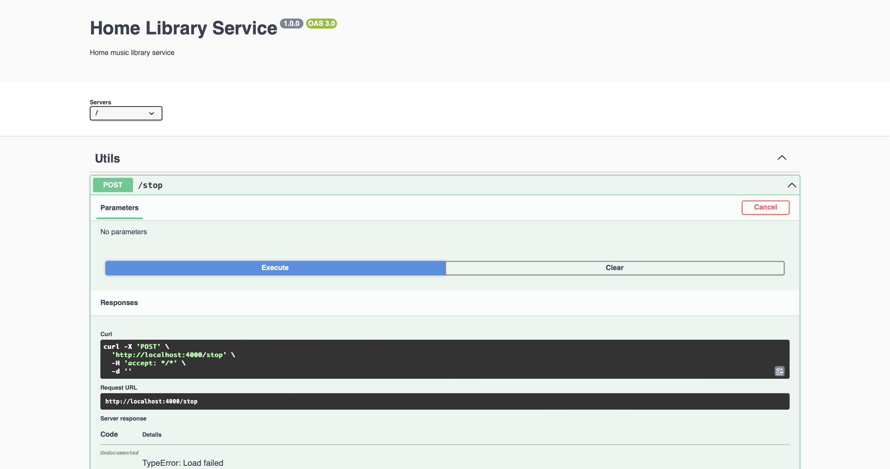
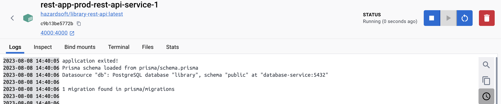
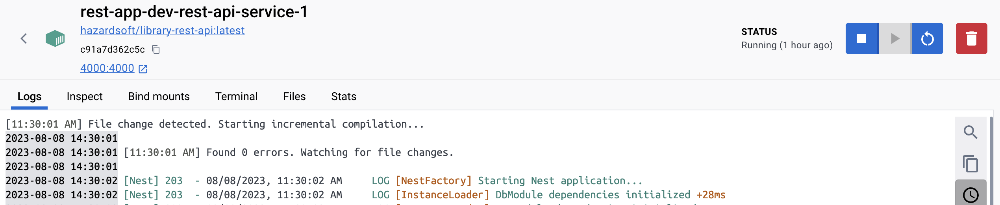
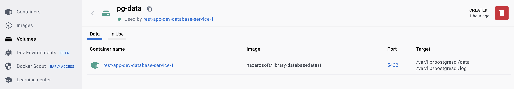
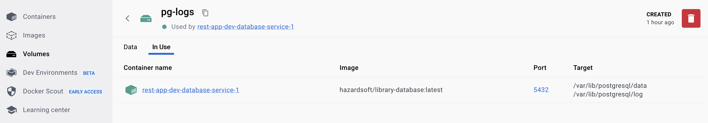
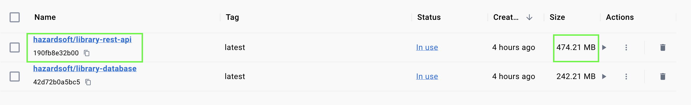
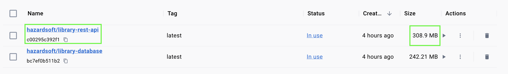
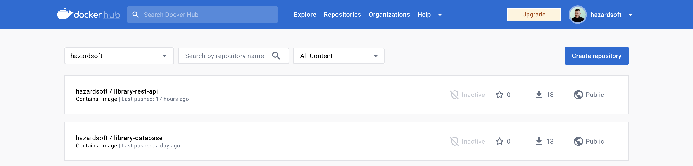

# Home Library Service, Part 2 (Containerization, Docker and Database & ORM)

## Contents

1. [Run Application](./README.md#running-application)
2. [Perform Verifications](./README.md#verifications)

## Prerequisites

- [Git](https://git-scm.com/downloads)
- [Node.js](https://nodejs.org/en/download/) (use 18 LTS version)
- [Docker](https://docs.docker.com/engine/install/)

## Downloading

```
git clone https://github.com/hazardsoft/nodejs2023Q2-service
git checkout docker
```

## Running Application

1. [Install dependencies](./README.md#installing-dependencies)
2. [Create .env config](./README.md#creating-env-config)
3. [Run application with Docker](./README.md#running-application-with-docker)
4. [Run application w/o Docker (optionally)](./README.md#running-application-wo-docker-optional)

### Installing Dependencies

```
npm install
```

### Creating .env Config

Copy/paste `.env.example` and rename it to `.env`.
Contents passed as ENV variables to `docker-compose.yml/docker-compose-prod.yml` when Docker Compose run.

### Running Application with Docker

Docker Compose is used to run application (REST API application and PostgreSQL server will be started).
There are 2 modes of running application: development and production. Each mode has distinguishing features described below:

#### Development Mode

Development mode is used for local development specifically and has number of distinguising features:
1. dedicated [Dockerfile-dev](./docker/rest/Dockerfile-dev) file is used to build REST API image (includes dev dependencies from `package.json`)
2. `src` and `test` local folders are binded to the REST API container to enable watch mode and provide ability to run tests in the container;
3. REST API application port is exposed to `localhost` so it can be tested locally (e.g. via Postman or http://localhost/doc Swagger docs);
4. Logs are enabled for PostgreSQL server;
5. PostgreSQL data and logs are stored in dedicated docker volumes (so they can be checked even after containers are stopped/destroyed);
6. PostgreSQL server port is exposed to `localhost` so a UI client (e.g. DBeaver) can be used to explore DB data.

```sh
start:
docker compose up --build --detach

stop:
docker compose down
```

#### Production Mode

Production mode is introduced for CI/CD use primarily and has number of distinguising features:
1. REST API service start depends on PostgreSQL service start after successful healthcheck only;
2. REST API and PostgreSQL both belong to the same custom network and use that network for communication: REST API is exposed to `localhost` while PostgreSQL not (can be accessed by REST API service only, no other container can communicate with PostgreSQL container);
3. REST API uses dedicated [Dockerfile](./docker/rest/Dockerfile) that does not include any dev dependencies from `package.json`;
4. No dedicated volumes are used to store data/logs;
5. None of local folders are bind mounted (dev watch and tests are not accessible).

```sh
start:
docker compose -f docker-compose-prod.yml up --build --detach
docker compose -f docker-compose-prod.yml up --detach (in case you do not want to build docker images locally but want to pull them from Docker Hub instead)

stop:
docker compose -f docker-compose-prod.yml down
```

### Running Application w/o Docker (optional)

Normally application should be run with Docker Compose (refer to [Running Application with Docker](./README.md#running-application-with-docker)).

If you still need to run application/tests w/o Docker (e.g. for better debug experience), the following steps should be done:
1. update `.env` file: change value of `POSTGRES_HOST` to `localhost`
2. run `docker compose up database-service --build --detach` command - runs PostgreSQL service only
3. run `npx prisma migrate deploy` - applies prisma migrations to the database started in p.2
4. run `npx prisma db seed` - seeds database started in p.2
5. run `npm run start:dev` 
6. run `npm run test`

## Verifications

1. [Run Tests](./README.md#run-tests)
2. [Custom Network](./README.md#custom-network)
3. [Container Auto Restart](./README.md#container-auto-restart)
4. [Application Auto Restart](./README.md#application-auto-restart)
5. [Database data/logs in Volumes](./README.md#database-datalogs-in-volumes)
6. [Docker Image Size](./README.md#docker-image-size)
7. [Vulnerabilities Check](./README.md#vulnerabilities-check)
8. [Docker Hub](./README.md#docker-hub)
9. [Database Migrations](./README.md#database-migrations)
10. [ESLint/Prettier](./README.md#eslintprettier)

### Run Tests

Run application in development mode. Open `Terminal` tab of REST API container, type in and run `npm run test` command (refer to image below).

**Please refer to [Development Mode](./README.md#development-mode) for more details**


### Custom Network

Custom network is configured and used if application is run in production mode only!
**Please refer to [Production Mode](./README.md#production-mode) for more details.**

### Container Auto Restart

Convenience `/stop` endpoint is introduced with [Swagger Docs](http://localhost:4000/doc/#/Utils/stopApplication) to ease functionality verification; under the hood it terminates node process with with status `code=1` (refer to image below).


Log message `application exited!` displays in a running docker container under `Logs` tab of Docker Desktop (refer to image below).


Rest API container auto restarts after crash if application is run in production mode only! (as dev mode uses wrapper service to run watch mode). **Please refer to [Production Mode](./README.md#production-mode) for more details**

### Application Auto Restart

REST API application restarts if changes are introduced into files under `src` folder.
Log message `File change detected. Starting incremental compilation...` displays in a running docker container under `Logs` tab of Docker Desktop (refer to image below).


Watch mode is used if application is run in development mode only!
**Please refer to [Development Mode](./README.md#development-mode) for more details**

### Database data/logs in Volumes

PostgreSQL data and logs are stored in corresponding volumes `pg-data` and `pg-logs` (refer to images below).



These volumes are created/used if application is run in development mode only!
**Please refer to [Development Mode](./README.md#development-mode) for more details**

### Docker Image Size

REST API is built into two different Docker images:
1. development (includes dev deps, built from [Dockerfile-dev](./docker/rest/Dockerfile-dev))
2. production (w/o dev deps, built from [Dockerfile](./docker/rest/Dockerfile), published to Docker Hub)
   
Both images are under 500mb due to use of multi-stage builds (refer to images below).



### Vulnerabilities Check

[Docker Scout](https://docs.docker.com/scout/) is used to scan images for vulnerabilities

To run security checks use the following NPM scripts:

```
npm run vulns:rest
npm run vulns:db
```

### Docker Hub

Both REST API and PostgreSQL docker images are published to Docker Hub (refer to image below):
1. [hazardsoft/library-rest-api](https://hub.docker.com/r/hazardsoft/library-rest-api)
2. [hazardsoft/library-database](https://hub.docker.com/r/hazardsoft/library-database)



### Database Migrations

[Prisma Migrate](https://www.prisma.io/docs/concepts/components/prisma-migrate) is used to apply migrations to a database and seeding right after REST API application starts (both in development and production modes).

The following commands are called when container starts:
1. `npx prisma migrate deploy` - Prisma applies migrations stored in `prisma/migrations` folder to a running database;
2. `npx prisma db seed` - Prisma runs `prisma:seed` command defined in `package.json` to create default `Favorites` entity.

### ESLint/Prettier

```
npm run lint
```

```
npm run format
```